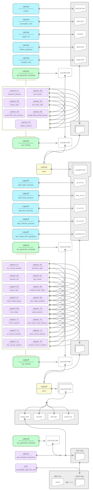

PuffR is all about helping you conduct dispersion modelling using the [CALPUFF modelling system](http://www.epa.gov/scram001/dispersion_prefrec.htm).

### Air Quality Modelling and CALPUFF

Air quality modelling is a great tool for describing the causal relationship between emissions, meteorology, atmospheric concentrations, deposition, and other factors. Air pollution measurements give useful quantitative information about ambient concentrations and deposition, however, such measurements can only describe air quality at specific locations and times. Moreover, monitoring usually doesn't provide very good information concerning the causes of the air quality problem. AQ modelling can instead provide a more complete deterministic description of the air quality problem, including an analysis of factors and causes (e.g., emission sources, meteorological processes, physical changes, and chemistry). Thus air quality models play an important role in science, because of their capability to assess the relative importance of the relevant processes. Air quality modelling is also an important tool for developing and evaluating air quality policy. Model outputs provide a wide assessment of the state of air quality across a given jurisdiction both in terms of airborne concentrations and potential human exposure and the deposition of acidifying and eutrophying pollutants. 

The CALPUFF integrated modelling system consists of three main components and a set of preprocessing and postprocessing programs. The main components of the modelling system are CALMET (a diagnostic 3-dimensional meteorological model), CALPUFF (an air quality dispersion model), and CALPOST (a postprocessing package). It's a great system.
 
### The Goals of the PuffR R Package Project

While CALPUFF is indeed great, the workflow for atmospheric dispersion modelling with CALPUFF needs to be reconsidered, both in the interest of saving time and also for ensuring that the quality of inputs is higher. Here are some ways that the PuffR package might provide some value:

— allow the user to provide a minimal set of parameters--we can then rely on a very sensible selection of defaults for PuffR to: (1) collect the best publicly available data, (2) process the collected data to generate model inputs, (3) perform model computations by the most efficient means possible, and (4) provide informative model output results and data visualizations

— include the ability to store presets (e.g., for model domains, receptors, emissions sources, etc.) that can be shared across projects

— have a useful help system and documentation library (with copious examples) available to aid in the understanding of every option/switch/setting in CALMET/CALPUFF/CALSUM/CALPOST

— include functions for a wide range of statistical analyses for both the input and the output data

— put a strong emphasis on data visualization and data exploration; this will allow for greater understanding for both experts and laypersons

— allow visualizations and data to be easily shared on the web, and, be made available in a wide range of useful formats

### How to go about this

The project is starting small. Hell, it's got to start somewhere. But we've got a great foundation! First off, we are using R. It's got everything we need to gather and organize datasets, do spatial/temporal tasks, produce beautiful visualizations, and publish on the web. Secondly, we have the CALPUFF code base to perform the numerical modelling. Nothing really has to be rewritten there, there just needs to be an interface. Perhaps some compiling from source will be done but *that's it*.

Dispersion modelling can be a complex process and, as with all models, the results are only as useful as the model itself and how it is used. Furthermore, such models need good data. Well, we have have an embarrassment of riches when it comes to data. It's very easily accessible now and the relevant data products are of exceptional quality (often taking years of work from a large number of contributors). Here are some suitable candidates for datasets that can be incorporated into a PuffR workflow:

| Type of Data | Description | Provider |
|--------------|-------------|----------|
| Surface station meteorology | 1-hourly global dataset for global met stations | National Climatic Data Center (NCDC) |
| Upper air data | global datasets spanning decades | RAOBS global archive of radiosonde/rawinsonde upper air data |
| Surface elevation | U.S. National Elevation Data (NED) | U.S. Geological Survey (USGS) |
|  | Canadian Digital Elevation Data (CDED) | GeoBase.ca |
|  | global SRTM V4 GeoTIFF archive | U.S. Geological Survey (USGS) |
| Landuse and land cover | U.S. National Land Cover Data (NLCD) 2011 | U.S. Geological Survey (USGS) / Multi-Resolution Land Characteristics Consortium (MRLC) |
|  | GeoBase Land Cover Product (Canada) | GeoBase.ca |
|  | GlobCover 2009 (Global Land Cover Map) | European Space Agency (ESA) data user element (due) |
|  | MODIS gridded land cover data (global) | MODIS data |
| Industrial emissions sources | a database of point and area emissions sources | US EPA National Emissions Inventory |
|  |  | Canadian NPRI Emissions Database | 
| Marine emissions sources | AIS ship positions + ship master data | various freely available sources |

Aside from the aforementioned data, there are also additional datasets available on a regional basis that may prove valuable in many instances (e.g., regionally-managed met stations, road activity data, etc.). For this reason, you can bring your own datasets (BYOD) and add those to the model inputs.

### Installation

Install PuffR from GitHub using the `devtools` package:

```R
require(devtools)
install_github('rich-iannone/PuffR')
```

It's early days so the package will be changing rapidly. I invite you to send me questions and comments about this. If you'd like to contribute, let me know and we can talk collaboration. Yeah, let's work together!

### PuffR Workflow

Creating working CALMET and CALPUFF input files, and executing the models, occurs through a stepwise process. Below is the basic workflow (functions on the left, input/output files on the right).




Let's generate a geophysical input file for a portion of the Vancouver area. This will consist of a grid centered (use `lat_lon_grid_loc = 1` for a center reference) on 49.196116ºN and 122.505866ºW (`lat_dec_deg = 49.196116` and `lon_dec_deg = -122.505866`). The width (E-W distance) of the grid will be 117000 m, and the height (N-S distance) will be 43250 m (`domain_width_m = 117000` and `domain_height_m = 43250`). We will download SRTM terrain height data from "http://gis-lab.info/data/srtm-tif/" (with `download_SRTM = TRUE`).

```R
calmet_define_geophys(location_name = "Vancouver"
                      lat_dec_deg = 49.196116,
                      lon_dec_deg = -122.505866,
                      lat_lon_grid_loc = 1,
                      domain_width_m = 117000,
                      domain_height_m = 43250,
                      cell_resolution_m = 500,
                      download_SRTM = TRUE)
```
Alternatively, if you elected to download the whole 11 GB set of SRTM V4 GeoTIFF zip files, you can reference the local folder that contains that archive:

```R
calmet_define_geophys(location_name = "Vancouver"
                      lat_dec_deg = 49.196116,
                      lon_dec_deg = -122.505866,
                      lat_lon_grid_loc = 1,
                      domain_width_m = 117000,
                      domain_height_m = 43250,
                      cell_resolution_m = 500,
                      download_SRTM = FALSE,
                      SRTM_file_path = "/Volumes/Big HD/SRTM V4 GeoTIFF/")
```

This function currently defaults to generating seasonal GEO.DAT files:

- `geo--vancouver-234x86x500--1-winter.txt`
- `geo--vancouver-234x86x500--2-spring.txt`
- `geo--vancouver-234x86x500--3-summer.txt`
- `geo--vancouver-234x86x500--4-fall.txt`
- `geo--vancouver-234x86x500--5-winter.txt`

The naming of these files is handled by PuffR. Functions for setting up the CALMET input file will rely on consistent naming of the files for file handling and for parsing the metadata that is stored within. This scheme allows for data persistence and minimal repetition of basic parameters. Here, the filename could be interpreted as: 

`[type]--[location_name]-[nx]x[ny]x[cell_resolution_m]--[season_no]-[season_name].txt`

How about surface meteorology? We can produce a SURF.DAT file using the `calmet_surface_met` function. In the following example, we can obtain a SURF.DAT file from the same domain.

```R
calmet_surface_met(location_name = "Vancouver",
                   year = 2011,
                   lat_dec_deg = 49.196116,
                   lon_dec_deg = -122.505866,
                   lat_lon_grid_loc = 1,
                   domain_width_m = 117000,
                   domain_height_m = 43250,
                   cell_resolution_m = 500,
                   time_offset = -8)
```
As for the `calmet_define_geophys` function, the `calmet_surface_met` function requires that you supply the following: `location_name`, `lat_dec_deg`, `lon_dec_deg`, `lat_lon_grid_loc`, `domain_width_m`, and `domain_height_m`. The `time_offset` value, which is the time difference from UTC+0000, is also required here to make adjustments to the time values in the meteorological source data (standardized to UTC+0000). The function will generate the following file:

- `surf--vancouver-234x86x500--2011.txt`

What about the upper air situation? That is also covered in PuffR. Simply use the `calmet_upper_air` function and an UP.DAT file will be generated.

```R
calmet_upper_air(location_name = "Vancouver",
                 year = 2011,
                 lat_dec_deg = 49.196116,
                 lon_dec_deg = -122.505866,
                 lat_lon_grid_loc = 1,
                 domain_width_m = 117000,
                 domain_height_m = 43250,
                 cell_resolution_m = 500,
                 time_offset = -8)
```

The output file will be generated and, in this case, it will be named:

- `up--vancouver-234x86x500--2011.txt`

After creating the CALMET input data files (e.g., GEO.DAT, SURF.DAT, etc.), the next logical step forward is to initialize a template of the CALMET control file (CALMET.INP) using the `calmet_inp_generate_template` function.

```R
calmet_inp_generate_template()
```

This creates an effectively empty CALMET input file in the working directory (called `calmet_template.txt`). While this file is readable plaintext, it really shouldn't be modified by hand. Rather, a group of functions will serve to programmatically populate that input file with parameter values. In this way, validation of inputs can be performed at every step.

The CALMET input file can be built up using a series of functions that address each of the input file's main sections.

```R
calmet_01_temporal_params()

calmet_02_grid_levels()

calmet_03_output_opts()

calmet_04_met_data_opts()

calmet_05_wind_field_opts_params()

calmet_06_mixhgt_temp_precip_params()

calmet_07_station_params()

calmet_inp_finalize()
```

While each of the above functions has a long list of arguments, sensible defaults for each parameter value are included. Furthermore, some functions will take data from input files (e.g., GEO.DAT, SURF.DAT, etc.) residing in the working folder. This strategy avoids possible errors from attempting to supply the same basic information multiple times. Of course, you will want to (and often need to) use specific options within each of the CALMET input section and that's entirely possible. For instance, the following function call will provide a value for `CONSTN` (the empirical mixing height constant for the stable mixing height equation) that is different than the default value of 2400:

```R
calmet_06_mixhgt_temp_precip_params(constn = 3000)
```

The call to the `calmet_inp_finalize` function completes the creation of the CALMET.INP file, checking the working directory for input files and assuming that the presence of those files means you'll want to include them in the CALMET model run. After all, if you went to the trouble of making those files, why wouldn't you want to use them? Running that function, creates the following files:

- `calmet_in--vancouver-234x86x500--2011-1-winter.txt`
- `calmet_in--vancouver-234x86x500--2011-2-spring.txt`
- `calmet_in--vancouver-234x86x500--2011-3-summer.txt`
- `calmet_in--vancouver-234x86x500--2011-4-fall.txt`
- `calmet_in--vancouver-234x86x500--2011-5-winter.txt`

These are all human-readable files. The actual files contain very little text, just some organizational headings and the pairings of CALMET keywords and values (wrapped in exclamation marks, as required by the model). Once the CALMET model is executed for each of these input files, the following binary output files are created:

- `calmet_out--vancouver-234x86x500--2011-1-winter.dat`
- `calmet_out--vancouver-234x86x500--2011-2-spring.dat`
- `calmet_out--vancouver-234x86x500--2011-3-summer.dat`
- `calmet_out--vancouver-234x86x500--2011-4-fall.dat`
- `calmet_out--vancouver-234x86x500--2011-5-winter.dat`

Accompanying these binary files are an analogous set of ascii-formatted .lst files (essentially diagnostics files):

- `calmet_out--vancouver-234x86x500--2011-1-winter.lst`
- `calmet_out--vancouver-234x86x500--2011-2-spring.lst`
- `calmet_out--vancouver-234x86x500--2011-3-summer.lst`
- `calmet_out--vancouver-234x86x500--2011-4-fall.lst`
- `calmet_out--vancouver-234x86x500--2011-5-winter.lst`

Okay, so the CALMET phase has been accomplished. Got output data. After that, it's time for another process to develop CALPUFF input files. We now need to initialize a template of the CALPUFF control file (CALPUFF.INP) using the `calpuff_inp_generate_template` function.

```R
calpuff_inp_generate_template()
```

This creates an effectively empty CALPUFF input file in the working directory (called `calpuff_template.txt`). Sound familiar? It's the exact same process as for the CALMET input file. Before we can progressively generate the CALPUFF.INP file using a series of builder functions, we must generate some data that those functions can use. These data will consist primarily of emissions sources and receptor locations.

To define point, area, line, or volume sources, use the functions `calpuff_add_point_sources`, `calpuff_add_area_sources`, `calpuff_add_line_sources`, or `calpuff_add_volume_sources`, respectively. To create a grid of discrete receptors, use the function `calpuff_def_recep_from_geophys`.

The CALPUFF input file can be built up using a series of functions that address each of the input file's main sections.

```R
calpuff_01_run_control_params()

calpuff_02_technical_opts()

calpuff_03_species_list()

calpuff_04_grid_levels()

calpuff_05_output_opts()

calpuff_06_complex_terrain_inputs()

calpuff_07_chem_ddep_gases()

calpuff_08_size_ddep_particles()

calpuff_09_misc_ddep()

calpuff_10_wdep_params()

calpuff_11_chem_params()

calpuff_12_misc_disp_comp_params()

calpuff_13_pt_source_params()

calpuff_14_area_source_params()

calpuff_15_line_source_params()

calpuff_16_volume_source_params()

calpuff_inp_finalize()
```

Calling each of these functions builds the temporary `calpuff_template.txt` file with default values. until the call to the `calpuff_inp_finalize` function, which create files with the following structure:

- `calpuff_in--[location_name]--[nx]x[ny]x[cell_resolution_m]--[year]--[source_id]--[pollutant].inp`

After running CALPUFF, files with the following structures will be generated:

- `calpuff_out--concdat--[location_name]--[nx]x[ny]x[cell_resolution_m]--[year]--[source_id]--[pollutant].dat`
- `calpuff_out--dfdat--[location_name]--[nx]x[ny]x[cell_resolution_m]--[year]--[source_id]--[pollutant].dat`
- `calpuff_out--wfdat--[location_name]--[nx]x[ny]x[cell_resolution_m]--[year]--[source_id]--[pollutant].dat`
- `calpuff_out--pufflist--[location_name]--[nx]x[ny]x[cell_resolution_m]--[year]--[source_id]--[pollutant].txt`

These correspond to (1) a binary concentration data file, (2) a binary dry flux data file, (3) a binary wet flux data file, and (4) an ascii list file (for run diagnostics).

### Project Roadmap

- greater selection of data sources for generating geophysical input files
- method to create a precipitation input file for CALMET (PRECIP.DAT)
- method to create an overwater meteorological data file for CALMET (SEA.DAT)
- method to import and validate MM4/MM5 files (3D.DAT)
- data imputation methods for upper air soundings
- method for specifying emissions sources and creating time-and-space-varying emissions for point, line, area, and volume sources
- method for computing building downwash for point sources near large structures (BPIP)
- output/visualization of concentrations at receptors
- documentation library for understanding model options and parameters
